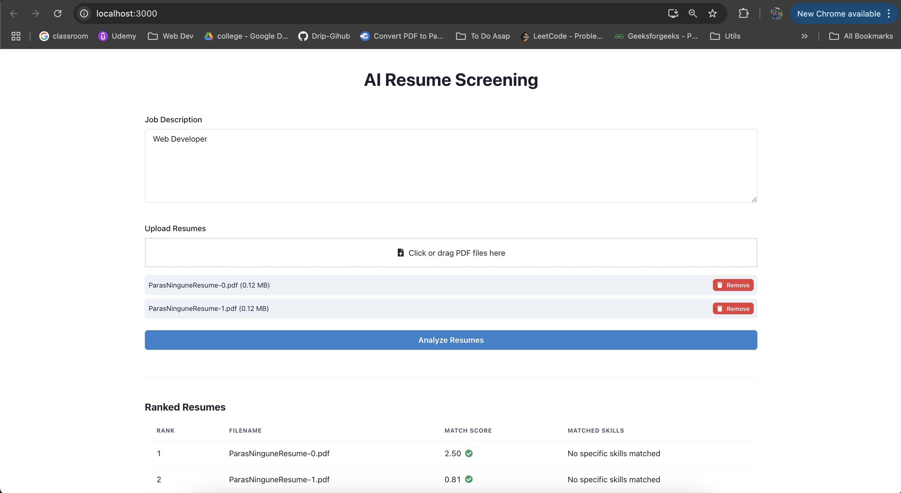

# 📄 AI Resume Screening  

AI-powered resume screening tool that analyzes resumes based on job descriptions and ranks them by relevance. Built with **React (Chakra UI)** for the frontend and **FastAPI/Flask** for the backend.  

 

---

## 🚀 Features  

✅ Upload multiple resumes in **PDF format** (max 5MB per file).  
✅ Enter a **job description** for AI-based resume screening.  
✅ **Ranks resumes** based on relevance & matched skills.  
✅ **Interactive UI** with progress indicators.  

---

## 🛠 Tech Stack  

### 🔹 Frontend  
- **React.js** with **Chakra UI**  
- File upload handling with progress UI  

### 🔹 Backend (Flask/FastAPI)  
- **Python** (Flask/FastAPI)  
- **NLP** techniques for text similarity  
- **PyPDF2** for PDF parsing  
